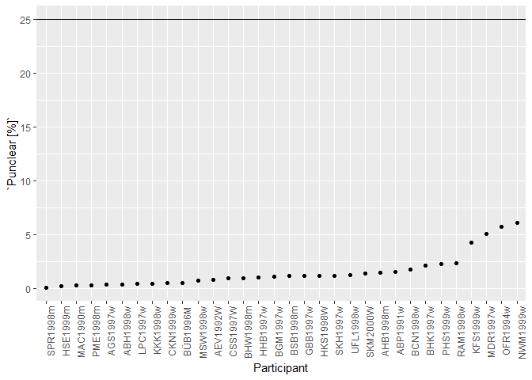

Perceptal switching rate between observers for KDE and NC displays
================
Alexander (Sasha) Pastukhov

This is a complete analysis that generates all figures and statistics
for the manuscript.

## Presets

``` r
rm(list= ls())

bootstrapN <- 2000
excluded_participant <- "BOF1999w"
unclear_must_be_below <- 25
```

Please note that we exclude participant BOF1999w from modelling, as she
had no reports for *slow-down* condition.

## Import and preprocessing

Merging all CSV-files into a single table and computing duration of the
invidiual dominance phases. Variables in the log files are:

  - **Session** session timestamp in the form of
    *year-month-day-hour-minute-second*.
  - **Participant** Unique participant ID.
  - **Block** Block index.
  - **Condition** Block condition, can be either *Passive*, *Speed-up*,
    or *Slow-down*.
  - **Display** Block display, can be either *KDE -45* (clockwise
    rotated kinetic-depth effect), *KDE 45* (counterclockwise rotated
    kinetic-depth effect), or *NC* (Necker cube lattice).
  - **OnsetDelay** Randomized delay before the stimulus onset in
    seconds.
  - **Percept** Perceptual reports (*left*, *right*, or *unclear*) or
    the *end of the block* message.
  - **Time** Time of the perceptual report or of the end of the block
    relative to the block start, in
seconds.

<!-- end list -->

``` r
raw_results <- tibble(filename= dir_ls(path= "Data", type= "file", glob= "*.csv")) %>%
    rowwise() %>%
    do(read_csv2(.$filename, locale = locale(decimal_mark = ","),
                 col_types = cols(Session = col_character(),
                      Participant = col_character(),
                      Block = col_integer(),
                      Condition = col_character(),
                      Display = col_character(),
                      OnsetDelay = col_number(),
                      Percept = col_character(),
                      Time = col_number()
                    ))) %>%
    ungroup() %>%

    # computing duration
    group_by(Participant, Block) %>%
    mutate(Duration= lead(Time) - Time) %>%
    ungroup() %>%
  
    # excluding participant from the analysis
    filter(Participant != excluded_participant)
```

Marking out “return transitions” (`ReturnTransition`) when same percepts
dominates after the unclear period.

``` r
raw_results <- raw_results %>%
    group_by(Participant, Block) %>%
    mutate(ReturnTransition= ifelse(Percept == "unclear" & 
                                    lag(Percept)!="unclear" & 
                                    lead(Percept)!= "unclear" & 
                                    lag(Percept) == lead(Percept), TRUE, FALSE), 
           ReturnTransition= ifelse(Percept != "unclear", NA, ReturnTransition))
```

If a return transition is shorter than the geometric mean of the
response time for the first percept for that particular stimulus, we
exclude it and merge two succesive percepts into a single longer
percept.

``` r
# computing geometric mean RT for each participant and display
avgRT <- raw_results %>%
    group_by(Participant, Display, Block) %>%
    summarise(firstRT= Time[1]) %>%
    group_by(Participant, Display) %>%
    summarise(geoMeanRT= exp(mean(log(firstRT))))

# marking out return transition that are too short 
raw_results <- raw_results %>%
    right_join(avgRT, by= c("Participant", "Display")) %>%
    mutate(MergePercept= ReturnTransition & Duration < geoMeanRT, 
           MergePercept= ifelse(is.na(MergePercept), FALSE, MergePercept)) %>%
    dplyr::select(-geoMeanRT)

raw_results <- raw_results %>%
    group_by(Participant, Display) %>%
    mutate(iPercept= 1:n())


# recomputing duration of the leading percept (merging two percepts together), 
# while dropping return transitions and second percept
results <- NULL
iRawRow <- 1
while (iRawRow <= nrow(raw_results)){
    if ((iRawRow < nrow(raw_results)) & (raw_results$MergePercept[iRawRow+1])){
        # next raw is marked return transition between two percepts to be merged
        leading_percept <- raw_results[iRawRow, ]
        while (raw_results$MergePercept[iRawRow+1]){
            iRawRow <- iRawRow + 2
            leading_percept$Duration <- raw_results$Time[iRawRow + 1] - leading_percept$Time
        }
        results <- rbind(results, leading_percept)
        iRawRow <- iRawRow + 1
    }
    else{
        # normal row, just copy it over
        results <- bind_rows(results, raw_results[iRawRow, ])
        iRawRow <- iRawRow + 1
    }
}
```

### Blocks with no reports

``` r
percepts_per_block <- 
  results %>%
  group_by(Participant, Block) %>%
  summarise(count= n()-1)

no_reports <- 100 * sum(percepts_per_block$count == 0) / nrow(percepts_per_block)
```

Blocks with no reports: 1.048951%.

### Unclear perception

``` r
unclear_per_block <-
  results %>%
  filter(Percept != "end of the block")  %>%
  
  group_by(Participant, Display, Block) %>%
  summarise(Punclear= 100.0 * sum(Duration[Percept == "unclear"], na.rm = TRUE) / sum(Duration, na.rm = TRUE))

blocks_above_unclear_limit <- round(100 * sum(unclear_per_block$Punclear >= unclear_must_be_below) / nrow(unclear_per_block), 1)
```

There were 2 blocks with unclear perception taking up more than 25% of
the total trial duration.

Average proportion of unclear perception for **unfiltered** data.

``` r
unclear_per_block %>%
  group_by(Participant) %>%
  summarise(`Punclear [%]`= mean(Punclear)) %>%
  mutate(Participant = as.factor(Participant), 
         Participant = fct_reorder(Participant, `Punclear [%]`)) %>%
  ggplot(aes(x=Participant, y= `Punclear [%]`)) + 
  geom_point() + 
  geom_hline(yintercept =  unclear_must_be_below) +
  theme(axis.text.x = element_text(angle = 90, hjust = 1))
```

<!-- -->

Average proportion of unclear perception if block with more than 25% of
unclear perception are excluded.

``` r
unclear_per_block %>%
  filter(Punclear < unclear_must_be_below) %>%
  group_by(Participant) %>%
  summarise(`Punclear [%]`= mean(Punclear)) %>%
  mutate(Participant = as.factor(Participant), 
         Participant = fct_reorder(Participant, `Punclear [%]`)) %>%
  ggplot(aes(x=Participant, y= `Punclear [%]`)) + 
  geom_point() + 
  geom_hline(yintercept =  unclear_must_be_below) +
  theme(axis.text.x = element_text(angle = 90, hjust = 1))
```

<!-- -->

Only retaining block with unclear perception below 25%.

``` r
results <- 
  results %>%
  filter(Percept != "end of the block")  %>%
  
  group_by(Participant, Display, Block) %>%
  mutate(Punclear= 100.0 * sum(Duration[Percept == "unclear"], na.rm = TRUE) / sum(Duration, na.rm = TRUE)) %>%
  
  filter(Punclear < unclear_must_be_below) %>%
  select(-Punclear)
```

### Extracting clear percepts for further analysis.

``` r
clear_percepts <- results %>%
  # filtering out "end of block" percepts
  filter(Percept != "end of the block")  %>%
  
  # removing last percept, as its duration was curtailed by the end of the block
  group_by(Session, Participant, Block) %>%
  mutate(iPercept= 1:n()) %>%
  arrange(Participant, Block, iPercept) %>%
  slice(1:(n()-1)) %>%
  arrange(Participant, Block) %>%
  
  # filtering out "unclear" percepts
  filter(Percept %in% c("left", "right")) %>%
  arrange(Participant, Block) %>%

  dplyr::select(-ReturnTransition, -MergePercept) %>%
  
  # whether speed-up condition came first
  group_by(Participant) %>%
  mutate(SpeedUp_first= min(Block[Condition=="Speed-up"]) < min(Block[Condition=="Slow-down"])) %>%
  ungroup()
```

## Basic demographics

``` r
participants <- 
  results %>% 
  group_by(Participant) %>%
  summarise() %>%
  mutate(gender= str_to_lower(str_sub(Participant, start= -1)), 
         year= as.integer(str_sub(Participant, start= 4, end= -2)))
```

Gender:

``` r
participants %>%
  count(gender) %>%
  mutate(gender= fct_recode(gender, male= "m", female= "w")) %>%
  kable()
```

| gender |  n |
| :----- | -: |
| male   |  8 |
| female | 24 |

Age:

``` r
participants %>%
  mutate(age= 2018-year) %>%
  summarise(youngest= min(age), 
            oldest= max(age)) %>%
  kable()
```

| youngest | oldest |
| -------: | -----: |
|       18 |     28 |

## Utilities

Routine that plots displays pairwise against each other and also reports
related specs. It ensure that all plots and statistics look consistent
across observables.

``` r
corrplot <- function(table, R= 2000, log_scale = TRUE){
  all_plots <- list()
  all_stats <- tibble()
  for(iFirst in 1:(length(unique(table$Display))-1)){
    for(iSecond in (iFirst + 1):length(unique(table$Display))){
      displays <- unique(table$Display)[c(iFirst, iSecond)]
      # subset with only two displays
      narrow_subset <- 
        table %>% 
        filter(Display %in% displays) %>%
        mutate(Display= as.factor(Display), 
               Display= fct_recode(Display, V1= displays[1], V2= displays[2]))
      
      wide_subset <- 
        narrow_subset %>%
        spread(key= Display, -Participant)
      
      # common limits for both x and y axis, so we can make a square plot
      limits <- narrow_subset %>% dplyr::select(-Display, -Participant) %>% summarise_all(c("min", "max"))
      min_limit <- limits$min[1] * 0.95
      max_limit <- limits$max[1] * 1.05

      # scatter plot with individual participants labeled by color
      all_plots[[length(all_plots)+1]] <-
          ggplot(data= wide_subset, aes(x= V1, y= V2)) + 
            geom_abline(slope = 1, color= "white") + 
            geom_point(aes(color= Participant)) + 
            geom_smooth(method= "lm", se = FALSE, color= "black") + 
            theme(legend.position = "none") + 
            xlab(displays[1]) + 
            ylab(displays[2]) +
            coord_equal()
      
      if (log_scale) {
        all_plots[[length(all_plots)]] <-
          all_plots[[length(all_plots)]] + 
            scale_x_log10(limits= c(min_limit, max_limit)) + 
            scale_y_log10(limits= c(min_limit, max_limit))
      } 
      else {
          all_plots[[length(all_plots)]] + 
            scale_x_continuous(limits= c(min_limit, max_limit)) + 
            scale_y_continuous(limits= c(min_limit, max_limit))
      }

      # frequentist correlation
      pearsonR <- cor.test(~ V2 + V1, data= wide_subset, method = "pearson")
      correlationR <- function(data, index, method){
        pR <-   suppressWarnings( cor.test(~ V2 + V1, data= data[index, ], 
                                           method = method))
        pR$estimate
      }
      boot_values <- boot(wide_subset, correlationR, R= R, method= "pearson")
      CIs <- boot.ci(boot_values, type = "bca")
      pearsonCI <- CIs$bca[4:5]
      
      # bayesian correlation
      bayesR <- bayes_cor.test(wide_subset$V1, wide_subset$V2, CI = 95)

      # plotting bootstrapped frequentist correlation and bayesian posterior distribution as histograms
      boot_corr <- rbind(data.frame(R= boot_values$t, method= "frequentist"), 
                         data.frame(R= bayesR$values$posterior, method= "bayesian"))
      all_plots[[length(all_plots)+1]] <-
        ggplot(boot_corr, aes(x= R, fill= method, group= method)) +
        geom_histogram(aes(y=0.5*..density..), binwidth=0.025, position= 'identity', alpha= 0.5) + 
        ylab('Density') + 
        scale_x_continuous(limits = c(-1, 1), 
                           breaks = round(c(-1, 0, 1, unname(pearsonR$estimate),  pearsonCI, bayesR$values$median, bayesR$values$CI_values), digits= 2)) +
        theme(legend.position = "none")
        
      # all stats in a single table
      all_stats <- rbind(all_stats, 
                         tibble(Display1= displays[1],
                                Display2= displays[2], 
                                R= pearsonR$estimate, 
                                frequentistL= pearsonCI[1], 
                                frequentistU= pearsonCI[2],
                                frequentistP= pearsonR$p.value, 
                                frequentistGT0= round(100*mean(boot_values$t>0), 1),
                                bayesianR= bayesR$values$median,
                                bayesianL= bayesR$values$CI_values[1],
                                bayesianU= bayesR$values$CI_values[2], 
                                bayesianBF= bayesR$values$bf, 
                                bayesianGT0= round(100 * mean(bayesR$values$posterior>0), 1)))
    }
  }
  
  single_plot <- ggarrange(plotlist = all_plots, 
          widths = c(1, 1), 
          ncol= 2, nrow= 3, 
          labels= intToUtf8(utf8ToInt("A") + c(0:5), multiple = TRUE))
  
  list(single_plot= single_plot, plots= all_plots, stats= all_stats)
}
```

## Comparing switching rate between displays conditions for passive viewing

Computing summary statistics for clear percepts

``` r
averages <- clear_percepts %>%
    group_by(Participant, Condition, Display) %>%
    summarise(Tmean= mean(Duration), 
              Tmedian= median(Duration), 
              Tgeomean= exp(mean(log(Duration))), 
              Cv= sd(Duration)/mean(Duration), 
              speedUp_First= SpeedUp_first[1])
```

### Passive viewing: Tmean

``` r
set.seed(6385088)
passive <- averages %>%
    filter(Condition == "Passive") %>%
    ungroup() %>%
    dplyr::select(Participant, Display, Tmean)

passive_results <- corrplot(passive, R= bootstrapN)
annotate_figure(passive_results[["single_plot"]], 
  top= text_grob("Passive viewing, <Tmean>"))
```

<!-- -->

``` r
ggsave("passive-tmean.pdf", passive_results[["single_plot"]], 
       units= "cm", width = 14, height= 20)

passive_results[["stats"]] %>%
  knitr::kable()
```

| Display1 | Display2 |           R | frequentistL | frequentistU | frequentistP | frequentistGT0 |   bayesianR |   bayesianL | bayesianU |   bayesianBF | bayesianGT0 |
| :------- | :------- | ----------: | -----------: | -----------: | -----------: | -------------: | ----------: | ----------: | --------: | -----------: | ----------: |
| KDE -45  | KDE 45   |   0.7064551 |    0.5651636 |    0.8083765 |    0.0000062 |          100.0 |   0.6713384 |   0.3790457 | 1.0094896 | 2226.4738500 |       100.0 |
| KDE -45  | NC       | \-0.1460575 |  \-0.3182161 |    0.1917909 |    0.4250766 |           13.0 | \-0.1204128 | \-0.4300925 | 0.2137868 |    0.5108234 |        23.6 |
| KDE 45   | NC       | \-0.0569944 |  \-0.2192766 |    0.2357831 |    0.7566873 |           28.1 | \-0.0485166 | \-0.3560779 | 0.2842577 |    0.4052855 |        38.6 |

### Passive viewing: geometric mean

This generates **Figure 2**.

``` r
set.seed(83148031)
passive <- averages %>%
    filter(Condition == "Passive") %>%
    ungroup() %>%
    dplyr::select(Participant, Display, Tgeomean)

passive_results <- corrplot(passive, R= bootstrapN)
annotate_figure(passive_results[["single_plot"]], 
  top= text_grob("Passive viewing, <Tgeomean>"))
```

<!-- -->

``` r
ggsave("passive-tgeomean.pdf", passive_results[["single_plot"]], 
       units= "cm", width = 14, height= 20)

passive_results[["stats"]] %>%
  knitr::kable()
```

| Display1 | Display2 |           R | frequentistL | frequentistU | frequentistP | frequentistGT0 |   bayesianR |   bayesianL | bayesianU |  bayesianBF | bayesianGT0 |
| :------- | :------- | ----------: | -----------: | -----------: | -----------: | -------------: | ----------: | ----------: | --------: | ----------: | ----------: |
| KDE -45  | KDE 45   |   0.6239793 |    0.4310925 |    0.7380347 |    0.0001356 |          100.0 |   0.5716005 |   0.2551407 | 0.8735032 | 189.7963073 |       100.0 |
| KDE -45  | NC       | \-0.1842422 |  \-0.3407220 |    0.2665034 |    0.3127636 |           10.2 | \-0.1522942 | \-0.4565008 | 0.1920402 |   0.6017803 |        18.9 |
| KDE 45   | NC       | \-0.1410528 |  \-0.3223075 |    0.2825236 |    0.4412813 |           18.4 | \-0.1130716 | \-0.4225587 | 0.2248825 |   0.5014405 |        24.1 |

### Cv during passive viewing

``` r
set.seed(7652564)
passive_cv <- averages %>%
    filter(Condition == "Passive") %>%
    ungroup() %>%
    dplyr::select(Participant, Display, Cv)


cv_results <- corrplot(passive_cv, R= bootstrapN)
annotate_figure(cv_results[["single_plot"]], 
  top= text_grob("Passive vieweing, <Cv>"))
```

<!-- -->

``` r
ggsave("passive-tmean.pdf", cv_results[["single_plot"]], 
       units= "cm", width = 14, height= 20)

cv_results[["stats"]] %>%
  knitr::kable()
```

| Display1 | Display2 |           R | frequentistL | frequentistU | frequentistP | frequentistGT0 |   bayesianR |   bayesianL | bayesianU | bayesianBF | bayesianGT0 |
| :------- | :------- | ----------: | -----------: | -----------: | -----------: | -------------: | ----------: | ----------: | --------: | ---------: | ----------: |
| KDE -45  | KDE 45   |   0.5699811 |    0.3013823 |    0.7728193 |    0.0006604 |          100.0 |   0.5115425 |   0.2160375 | 0.8305116 | 54.2398766 |       100.0 |
| KDE -45  | NC       |   0.0381841 |  \-0.2213196 |    0.3400270 |    0.8356323 |           59.4 |   0.0325858 | \-0.2942589 | 0.3472741 |  0.3961931 |        57.9 |
| KDE 45   | NC       | \-0.3035781 |  \-0.6320750 |    0.0968911 |    0.0912003 |            8.6 | \-0.2576448 | \-0.5506222 | 0.0868783 |  1.3183654 |         6.4 |

## Comparing dominance time distributions for two displays are identical for each participant

### Utility functions

Please note that function “perm.t.test” is a copied from package
*Deducer* rather than used directly from package. The reason for that is
a large overhead (Java, interactive window, etc.) associated with
loading the package’s namescape. Otherwise, the function code is
identical to that of the package, as of 25/01/2019 ([source at
github](https://github.com/cran/Deducer/blob/master/R/perm.t.test.R)).

``` r
perm.t.test<-function(x,y,statistic=c("t","mean"),
            alternative=c("two.sided", "less", "greater"), midp=TRUE, B=10000){
    DNAME <- paste(deparse(substitute(x)), "and", deparse(substitute(y)))
    x<-na.omit(x)
    y<-na.omit(y)
    nx<-length(x)
    ny<-length(y)
    alternative<-match.arg(alternative)
    statistic<-match.arg(statistic)
    mult<- if(midp) .5 else 1
    var1<-var#function(s){.Internal(cov(s, NULL, TRUE, FALSE))}
    sum1<-.Primitive("sum")
    dat<-c(x,y) 
    if(statistic=="mean"){
        METHOD<-paste("Two-Sample permutation test using mean difference (B=", B,")")
        stat<-sum(y)
        nmin<-ny
        samp<-replicate(B,sum(sample(dat,nmin)))
        STAT<-mean(x)-mean(y)
        names(STAT)<-"Mean Difference"
    }else{
        METHOD<-paste("Two-Sample permutation test using Welsh's t (B=",B,")")
        stat<-(mean(x)- mean(y))/sqrt(var1(x)/nx+var1(y)/ny)
        samp<-replicate(B,sample(dat,nx+ny))
        sx<-apply(samp[1:nx,],2,function(s) c(sum1(s),var1(s)))
        sy<-apply(samp[(nx+1):(nx+ny),],2,function(s) c(sum1(s),var1(s)))
        samp<-(sx[1,]/nx-sy[1,]/ny)/sqrt(sx[2,]/nx+sy[2,]/ny)
        STAT<-stat
        names(STAT)<-"Welsh t-statistic"
    }
    lower<-sum(samp<stat)/(B+1)
    upper<-sum(samp>stat)/(B+1)
    equal<-sum(samp==stat)/(B+1)
    if(alternative=="two.sided")
        p.value<-2*min(lower,upper)+2*mult*equal
    else if(alternative=="less")
        p.value<-lower+mult*equal
    else
        p.value<-upper+mult*equal
    p.value<-min(p.value,1)
    RVAL<-list(statistic=STAT,p.value=p.value,method=METHOD,data.name=DNAME,
                alternative=alternative,B=B)
    class(RVAL)<-"htest"
    return(RVAL)
}
```

``` r
dist_ttest <- function(data){
  displays <- unique(data$Display)
  
  ttest_results <- perm.t.test(data$logDuration[data$Display == displays[1]], 
                               data$logDuration[data$Display == displays[2]])
  
  bayes_results <- extractBF(ttestBF(data$logDuration[data$Display == displays[1]], 
                                     data$logDuration[data$Display == displays[2]])) 
  tibble(BF= bayes_results$bf, 
         `Welsh t-statistic` = ttest_results$statistic, 
         p.value = ttest_results$p.value)
}


compare_logtimes <- function(data, displays){
  data %>%
    filter(Display %in% displays, Participant != excluded_participant) %>%
    
    # logtransforming durations
    mutate(logDuration= log(Duration)) %>%

    # computing t-test per observer
    group_by(Participant) %>%
    do(dist_ttest(.)) %>%
    
    # adjusting p-values for multiple comparisons
    mutate(p.adj= p.adjust(p.value)) %>%
    ungroup() %>%
    mutate(p.adj= p.adjust(p.value)) %>%
    arrange(p.adj)
}
```

### Comparing two KDEs

``` r
set.seed(9703620)
kdes <- compare_logtimes(clear_percepts, c("KDE 45",  "KDE -45"))

p_above_05 <- sum(kdes$p.adj < 0.05)
p_above_10 <- sum(kdes$p.adj < 0.10)
bf_above_3 <- sum(kdes$BF > 3)
total_n <- nrow(kdes)

kdes %>%
  knitr::kable()
```

| Participant |          BF | Welsh t-statistic |   p.value |     p.adj |
| :---------- | ----------: | ----------------: | --------: | --------: |
| NWM1999w    | 409.4907161 |         4.1674988 | 0.0000000 | 0.0000000 |
| UFL1998w    | 258.0778773 |         4.1846306 | 0.0000000 | 0.0000000 |
| BHW1998m    |  40.4290823 |       \-3.5363188 | 0.0002000 | 0.0059994 |
| AHB1998m    |   9.0478097 |       \-3.0556984 | 0.0011999 | 0.0347965 |
| GBB1997w    |   6.7309971 |       \-2.8381908 | 0.0035996 | 0.1007899 |
| PHS1999w    |  11.2610556 |       \-2.9892731 | 0.0047995 | 0.1295870 |
| HSE1999m    |   3.4153241 |       \-2.6563230 | 0.0081992 | 0.2131787 |
| BCN1998w    |   2.1780363 |       \-2.3826779 | 0.0205979 | 0.5149485 |
| MDR1997w    |   1.2866255 |         2.1670774 | 0.0305969 | 0.7343266 |
| BÜB1996M    |   1.5099518 |       \-2.1325010 | 0.0345965 | 0.7957204 |
| KKK1998w    |   1.1479200 |         2.1348177 | 0.0367963 | 0.8095190 |
| MSW1998w    |   0.8678776 |       \-1.9834502 | 0.0443956 | 0.9323068 |
| ABH1998w    |   0.1760626 |         0.3457333 | 0.7215278 | 1.0000000 |
| ABP1991w    |   0.2783828 |       \-1.0078276 | 0.3181682 | 1.0000000 |
| AEV1992W    |   0.4763983 |       \-1.3737313 | 0.1723828 | 1.0000000 |
| AGS1997w    |   0.1288383 |         0.5057866 | 0.6035396 | 1.0000000 |
| BGM1997w    |   0.1577560 |         0.0305633 | 0.9817018 | 1.0000000 |
| BHK1997w    |   0.1285528 |         0.6906897 | 0.4937506 | 1.0000000 |
| BSB1998m    |   0.1286033 |       \-0.1855585 | 0.8559144 | 1.0000000 |
| CKN1999w    |   0.1914850 |         0.3906422 | 0.7111289 | 1.0000000 |
| CSS1997W    |   0.2559232 |       \-0.6775135 | 0.5083492 | 1.0000000 |
| HHB1997w    |   0.1942442 |         0.4484940 | 0.6805319 | 1.0000000 |
| HKS1998W    |   0.1260475 |       \-0.2791469 | 0.7951205 | 1.0000000 |
| KFS1999w    |   0.1672109 |         0.2266990 | 0.8089191 | 1.0000000 |
| LPC1997w    |   0.8207828 |         1.9376131 | 0.0589941 | 1.0000000 |
| MAC1990m    |   0.2919089 |       \-1.2987762 | 0.1933807 | 1.0000000 |
| OFR1994w    |   0.1091507 |         0.0704982 | 0.9265073 | 1.0000000 |
| PME1998m    |   0.2482935 |         1.0169371 | 0.3161684 | 1.0000000 |
| RAM1998w    |   0.1619263 |       \-0.5031909 | 0.6159384 | 1.0000000 |
| SKH1997w    |   0.2735939 |       \-1.2189140 | 0.2183782 | 1.0000000 |
| SKM2000W    |   0.1526016 |         0.1963134 | 0.8291171 | 1.0000000 |
| SPR1998m    |   0.1886436 |       \-0.8343252 | 0.3811619 | 1.0000000 |

Adjusted p-values below .05: 4 out of 32.

Adjusted p-values below .1: 4 out of 32.

Bayes factor above 3: 7 out of 32.

### KDE CW versus NC

``` r
set.seed(1248764)
kde45_nc <- compare_logtimes(clear_percepts, c("KDE 45",  "NC"))

p_above_05 <- sum(kde45_nc$p.adj < 0.05)
p_above_10 <- sum(kde45_nc$p.adj < 0.10)
bf_above_3 <- sum(kde45_nc$BF > 3)
total_n <- nrow(kde45_nc)

kde45_nc %>%
  knitr::kable()
```

| Participant |           BF | Welsh t-statistic |   p.value |     p.adj |
| :---------- | -----------: | ----------------: | --------: | --------: |
| ABP1991w    | 1.025049e+09 |         6.0357277 | 0.0000000 | 0.0000000 |
| AEV1992W    | 1.794205e+28 |        12.7359305 | 0.0000000 | 0.0000000 |
| AGS1997w    | 5.810775e+11 |         7.7686062 | 0.0000000 | 0.0000000 |
| BCN1998w    | 8.771479e+07 |       \-7.2999691 | 0.0000000 | 0.0000000 |
| BGM1997w    | 3.085591e+16 |        10.4844128 | 0.0000000 | 0.0000000 |
| BSB1998m    | 1.598904e+48 |        14.2950278 | 0.0000000 | 0.0000000 |
| CKN1999w    | 2.848611e+23 |        12.5050447 | 0.0000000 | 0.0000000 |
| GBB1997w    | 5.311617e+13 |         7.7778644 | 0.0000000 | 0.0000000 |
| HHB1997w    | 4.373484e+20 |        11.1396018 | 0.0000000 | 0.0000000 |
| HSE1999m    | 2.195912e+11 |         8.3103657 | 0.0000000 | 0.0000000 |
| LPC1997w    | 1.266793e+04 |         4.4798989 | 0.0000000 | 0.0000000 |
| MSW1998w    | 1.237936e+05 |         5.4875991 | 0.0000000 | 0.0000000 |
| OFR1994w    | 5.937376e+04 |         5.3730658 | 0.0000000 | 0.0000000 |
| PHS1999w    | 3.147071e+05 |         5.6458692 | 0.0000000 | 0.0000000 |
| PME1998m    | 1.438309e+08 |         6.9946629 | 0.0000000 | 0.0000000 |
| SKM2000W    | 4.578027e+08 |         6.3072718 | 0.0000000 | 0.0000000 |
| BHW1998m    | 6.445262e+01 |         3.5908519 | 0.0002000 | 0.0031997 |
| MAC1990m    | 1.394946e+06 |       \-3.7505885 | 0.0004000 | 0.0059994 |
| NWM1999w    | 3.816319e+01 |       \-3.4931850 | 0.0004000 | 0.0059994 |
| HKS1998W    | 2.193694e+01 |         3.2457987 | 0.0023998 | 0.0311969 |
| KKK1998w    | 4.202928e+00 |         2.7463923 | 0.0041996 | 0.0503950 |
| RAM1998w    | 1.069984e+01 |         3.0400930 | 0.0041996 | 0.0503950 |
| ABH1998w    | 4.673190e+00 |         2.7295402 | 0.0083992 | 0.0819918 |
| CSS1997W    | 6.432570e+00 |         2.5611247 | 0.0081992 | 0.0819918 |
| MDR1997w    | 2.581582e+00 |         2.5223266 | 0.0131987 | 0.1055894 |
| SPR1998m    | 2.404995e+00 |         2.4163872 | 0.0151985 | 0.1063894 |
| KFS1999w    | 6.770816e-01 |         1.5784321 | 0.1121888 | 0.6731327 |
| AHB1998m    | 1.382976e-01 |       \-0.8365560 | 0.4041596 | 1.0000000 |
| BHK1997w    | 1.227600e-01 |         0.5437680 | 0.5831417 | 1.0000000 |
| BÜB1996M    | 2.304513e-01 |         0.9395280 | 0.3513649 | 1.0000000 |
| SKH1997w    | 1.825877e-01 |         0.8240312 | 0.4141586 | 1.0000000 |
| UFL1998w    | 1.990333e-01 |       \-0.9321696 | 0.3531647 | 1.0000000 |

Adjusted p-values below .05: 20 out of 32.

Adjusted p-values below .1: 24 out of 32.

Bayes factor above 3: 24 out of 32.

### KDE CCW versus NC

``` r
set.seed(8371171)
kdem45_nc <- compare_logtimes(clear_percepts, c("KDE -45",  "NC"))

p_above_05 <- sum(kdem45_nc$p.adj < 0.05)
p_above_10 <- sum(kdem45_nc$p.adj < 0.10)
bf_above_3 <- sum(kdem45_nc$BF > 3)
total_n <- nrow(kdem45_nc)

kdem45_nc %>%
  knitr::kable()
```

| Participant |           BF | Welsh t-statistic |   p.value |     p.adj |
| :---------- | -----------: | ----------------: | --------: | --------: |
| ABP1991w    | 5.023631e+06 |         5.4995388 | 0.0000000 | 0.0000000 |
| AEV1992W    | 2.468537e+14 |         6.5513020 | 0.0000000 | 0.0000000 |
| AGS1997w    | 2.209039e+13 |         8.1553253 | 0.0000000 | 0.0000000 |
| AHB1998m    | 2.096855e+03 |       \-4.6001013 | 0.0000000 | 0.0000000 |
| BCN1998w    | 3.475695e+03 |         4.8646321 | 0.0000000 | 0.0000000 |
| BGM1997w    | 1.569924e+14 |         9.0626753 | 0.0000000 | 0.0000000 |
| BSB1998m    | 9.428101e+49 |        15.1649406 | 0.0000000 | 0.0000000 |
| CKN1999w    | 2.408669e+23 |        11.7035701 | 0.0000000 | 0.0000000 |
| GBB1997w    | 1.321004e+06 |         5.6429353 | 0.0000000 | 0.0000000 |
| HHB1997w    | 3.124284e+17 |         8.4393018 | 0.0000000 | 0.0000000 |
| KKK1998w    | 2.559131e+03 |         4.6023885 | 0.0000000 | 0.0000000 |
| MAC1990m    | 2.696735e+08 |       \-4.0349216 | 0.0000000 | 0.0000000 |
| MDR1997w    | 4.735623e+02 |         4.2488419 | 0.0000000 | 0.0000000 |
| OFR1994w    | 6.650230e+04 |         5.3556620 | 0.0000000 | 0.0000000 |
| PME1998m    | 6.466129e+09 |         7.5814297 | 0.0000000 | 0.0000000 |
| SKM2000W    | 1.521885e+10 |       \-7.6400986 | 0.0000000 | 0.0000000 |
| UFL1998w    | 1.666240e+02 |         3.8737470 | 0.0002000 | 0.0031997 |
| RAM1998w    | 9.405891e+00 |         2.9583758 | 0.0015998 | 0.0239976 |
| HKS1998W    | 8.035115e+00 |         2.9112897 | 0.0029997 | 0.0391961 |
| LPC1997w    | 2.714312e+01 |         3.0916928 | 0.0027997 | 0.0391961 |
| PHS1999w    | 9.614914e+00 |         2.9853358 | 0.0043996 | 0.0527947 |
| ABH1998w    | 6.430925e+00 |         2.8341281 | 0.0063994 | 0.0703930 |
| MSW1998w    | 7.284535e+00 |         2.8379114 | 0.0065993 | 0.0703930 |
| CSS1997W    | 1.802140e+00 |         2.1832509 | 0.0283972 | 0.2555744 |
| HSE1999m    | 7.772013e+00 |         2.1446899 | 0.0405959 | 0.3247675 |
| SPR1998m    | 5.607071e-01 |         1.7861433 | 0.0637936 | 0.4465553 |
| KFS1999w    | 8.134613e-01 |         1.7067991 | 0.0833917 | 0.5003500 |
| BÜB1996M    | 3.609836e-01 |       \-1.4686805 | 0.1387861 | 0.6939306 |
| BHK1997w    | 2.533675e-01 |         1.3366049 | 0.1785821 | 0.7143286 |
| BHW1998m    | 1.280927e-01 |       \-0.0742183 | 0.9493051 | 1.0000000 |
| NWM1999w    | 1.215873e-01 |         0.1871750 | 0.8469153 | 1.0000000 |
| SKH1997w    | 1.365899e-01 |       \-0.3806479 | 0.6931307 | 1.0000000 |

## Volitional control

### Overall speed-up and slow-down

This generates **Figure 3** and **Table 1**.

``` r
set.seed(25212095)
volition <- 
  averages %>%
  ungroup() %>%
  group_by(Participant, Display, speedUp_First) %>%
  summarise(`Speed-Up`= Tgeomean[Condition=="Speed-up"]/Tgeomean[Condition == "Passive"], 
            `Slow-Down`= Tgeomean[Condition=="Slow-down"]/Tgeomean[Condition == "Passive"]) %>%
  gather(key= "Condition", value= "Ratio", -Participant, -Display, -speedUp_First) %>%
  ungroup() %>%
  mutate(Condition= as.factor(Condition)) %>%
  mutate(Condition= fct_relevel(Condition, "Speed-Up")) %>%
  
  # reversing speedUp_First for Slow-Down condition
  ungroup() %>%
  mutate(speedUp_First= ifelse(Condition == "Slow-down", !speedUp_First, speedUp_First)) %>%
  mutate(`Experiment Part`= ifelse(speedUp_First, '2', '3')) %>%
  select(-speedUp_First) %>%
  
  # adding mean for each Display, Condition, and speedUp_First
  group_by(Display, Condition, `Experiment Part`) %>%
  mutate(MeanRatio= mean(Ratio))

ggplot(data= volition, aes(x= Ratio, fill= `Experiment Part`)) + 
  geom_histogram(aes(y=0.5*..density..), binwidth=0.25, position= 'identity', alpha= 0.5) + 
  geom_vline(xintercept = 1) + 
  geom_vline(aes(xintercept =  MeanRatio, color= `Experiment Part`), size= 1) +
  scale_x_log10(name= "Change as ratio") + 
  ylab("Density") + 
  # theme(legend.position = 'none')+
  facet_grid(Condition~Display, scales = "free_y")
```

<!-- -->

``` r
ggsave("change-ratio.pdf",
       units= "cm", width = 14, height= 12)


volition$Display <- as.factor(volition$Display)
volition$`Experiment Part` <- as.factor(volition$`Experiment Part`)
summary(aovp(Ratio ~ Display * `Experiment Part` * Condition, data= volition))
```

    ## [1] "Settings:  unique SS "

    ## Component 1 :
    ##                                      Df R Sum Sq R Mean Sq Iter Pr(Prob)
    ## Display                               2    1.293    0.6463  541  0.16081
    ## `Experiment Part`                     1    0.724    0.7242  173  0.36994
    ## Display:`Experiment Part`             2    0.938    0.4688  442  0.70588
    ## Condition                             1    9.300    9.3004 5000  < 2e-16
    ## Display:Condition                     2    0.493    0.2463  117  0.60684
    ## `Experiment Part`:Condition           1    0.411    0.4106  248  0.29032
    ## Display:`Experiment Part`:Condition   2    2.857    1.4286 4555  0.02151
    ## Residuals                           180   94.348    0.5242              
    ##                                        
    ## Display                                
    ## `Experiment Part`                      
    ## Display:`Experiment Part`              
    ## Condition                           ***
    ## Display:Condition                      
    ## `Experiment Part`:Condition            
    ## Display:`Experiment Part`:Condition *  
    ## Residuals                              
    ## ---
    ## Signif. codes:  0 '***' 0.001 '**' 0.01 '*' 0.05 '.' 0.1 ' ' 1

``` r
sort(anovaBF(Ratio ~ Display + `Experiment Part` + Condition, data= volition), decreasing = TRUE)
```

    ## Bayes factor analysis
    ## --------------
    ## [1] Condition                                                                                                                                                        : 357.4861    ±0%
    ## [2] Condition + `Experiment Part`                                                                                                                                    : 105.7406    ±0.88%
    ## [3] Display + Condition                                                                                                                                              : 59.07006    ±3.75%
    ## [4] Condition + `Experiment Part` + Condition:`Experiment Part`                                                                                                      : 31.23824    ±4.64%
    ## [5] Display + Condition + `Experiment Part`                                                                                                                          : 17.99109    ±8.29%
    ## [6] Display + Condition + Display:Condition                                                                                                                          : 7.934343    ±1.61%
    ## [7] Display + Condition + `Experiment Part` + Condition:`Experiment Part`                                                                                            : 5.196758    ±5.44%
    ## [8] Display + Condition + `Experiment Part` + Display:`Experiment Part`                                                                                              : 3.167847    ±2.56%
    ## [9] Display + Condition + Display:Condition + `Experiment Part`                                                                                                      : 2.348452    ±2%
    ## [10] Display + Condition + `Experiment Part` + Display:`Experiment Part` + Condition:`Experiment Part`                                                               : 0.9297784   ±2.87%
    ## [11] Display + Condition + Display:Condition + `Experiment Part` + Condition:`Experiment Part`                                                                       : 0.7022119   ±2.66%
    ## [12] Display + Condition + Display:Condition + `Experiment Part` + Display:`Experiment Part`                                                                         : 0.471874    ±2.71%
    ## [13] Experiment Part                                                                                                                                                 : 0.2821478   ±0%
    ## [14] Display + Condition + Display:Condition + `Experiment Part` + Display:`Experiment Part` + Condition:`Experiment Part` +     Display:Condition:`Experiment Part` : 0.170581    ±5.37%
    ## [15] Display                                                                                                                                                         : 0.1487315   ±0.01%
    ## [16] Display + Condition + Display:Condition + `Experiment Part` + Display:`Experiment Part` + Condition:`Experiment Part`                                           : 0.1460546   ±3.83%
    ## [17] Display + `Experiment Part`                                                                                                                                     : 0.04344368  ±3.36%
    ## [18] Display + `Experiment Part` + Display:`Experiment Part`                                                                                                         : 0.007288419 ±1.39%
    ## 
    ## Against denominator:
    ##   Intercept only 
    ## ---
    ## Bayes factor type: BFlinearModel, JZS

### Speed up

This generates **Figure 4**.

``` r
set.seed(3710789)
speedup <- averages %>%
  ungroup() %>%
  filter(Condition %in% c("Passive", "Speed-up")) %>%
  group_by(Participant, Display) %>%
  summarise(SpeedUpRatio= Tgeomean[Condition=="Speed-up"]/Tgeomean[Condition == "Passive"]) %>%
  ungroup()


speedup_results <- corrplot(speedup, R= bootstrapN)
annotate_figure(speedup_results[["single_plot"]], 
  top= text_grob("Speed-up ratio"))
```

<!-- -->

``` r
ggsave("speedup-ratio.pdf", speedup_results[["single_plot"]], 
       units= "cm", width = 14, height= 20)

speedup_results[["stats"]] %>%
  knitr::kable()
```

| Display1 | Display2 |         R | frequentistL | frequentistU | frequentistP | frequentistGT0 | bayesianR |   bayesianL | bayesianU |  bayesianBF | bayesianGT0 |
| :------- | :------- | --------: | -----------: | -----------: | -----------: | -------------: | --------: | ----------: | --------: | ----------: | ----------: |
| KDE -45  | KDE 45   | 0.7233869 |    0.5181504 |    0.8398449 |    0.0000029 |          100.0 | 0.6913580 |   0.4186072 | 1.0536688 | 4113.731551 |       100.0 |
| KDE -45  | NC       | 0.3979662 |    0.0792062 |    0.6143743 |    0.0240857 |           99.8 | 0.3423039 |   0.0277405 | 0.6536058 |    3.421269 |        98.0 |
| KDE 45   | NC       | 0.3536454 |    0.0091826 |    0.5710296 |    0.0470757 |           99.0 | 0.2983200 | \-0.0156049 | 0.6038953 |    2.099141 |        96.7 |

### Slow down

This generates **Figure 5**.

``` r
set.seed(5666438)
slowdown <- averages %>%
  ungroup() %>%
  filter(Condition %in% c("Passive",  "Slow-down")) %>%
  
  # excluding participant with incomplete set of blocks
  group_by(Participant, Display) %>%
  summarise(SlowDownRatio= Tgeomean[Condition=="Slow-down"]/Tgeomean[Condition == "Passive"]) %>%
  ungroup()


slowdown_results <- corrplot(slowdown, R= bootstrapN)
annotate_figure(slowdown_results[["single_plot"]], 
  top= text_grob("Slowing down"))
```

<!-- -->

``` r
ggsave("slowdown-ratio.pdf", slowdown_results[["single_plot"]], 
       units= "cm", width = 14, height= 20)

slowdown_results[["stats"]] %>%
  knitr::kable()
```

| Display1 | Display2 |         R | frequentistL | frequentistU | frequentistP | frequentistGT0 | bayesianR |   bayesianL | bayesianU |   bayesianBF | bayesianGT0 |
| :------- | :------- | --------: | -----------: | -----------: | -----------: | -------------: | --------: | ----------: | --------: | -----------: | ----------: |
| KDE -45  | KDE 45   | 0.8785014 |    0.5445219 |    0.9455125 |    0.0000000 |          100.0 | 0.8977187 |   0.6888471 | 1.4695656 | 3.518423e+07 |       100.0 |
| KDE -45  | NC       | 0.0323596 |  \-0.5529011 |    0.7977497 |    0.8604382 |           61.7 | 0.0285572 | \-0.2941263 | 0.3386991 | 3.941375e-01 |        56.6 |
| KDE 45   | NC       | 0.0721943 |  \-0.3210775 |    0.7259955 |    0.6945726 |           64.0 | 0.0589802 | \-0.2552841 | 0.3852632 | 4.155170e-01 |        63.8 |

Adjusted p-values below .05: 20 out of 32.

Adjusted p-values below .1: 23 out of 32.

Bayes factor above 3: 24 out of 32.
